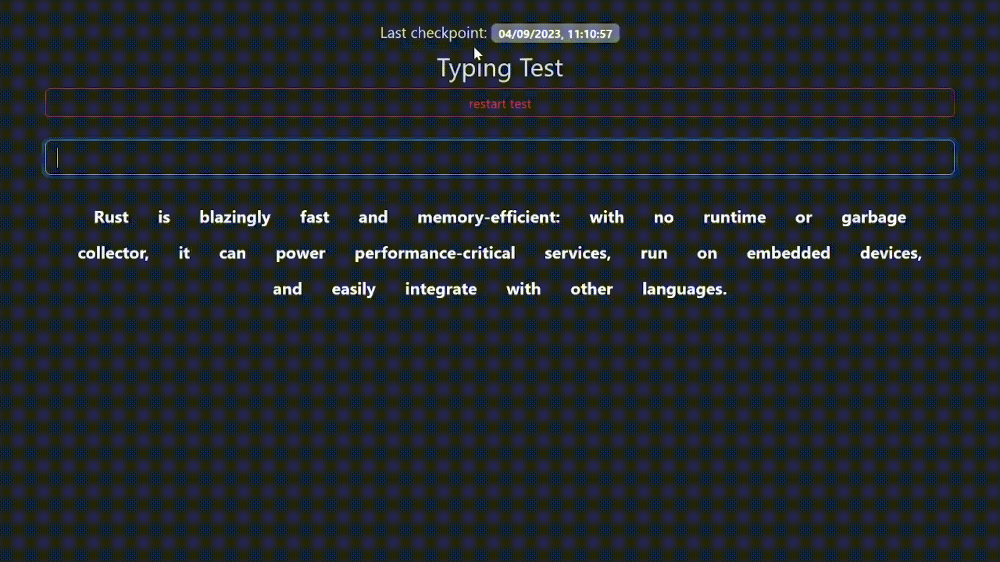

## Application Checkpoint
This _Typing Test_ application has a checkpointing system, it restore his status on any moment, providing a status restore subsystem.

### Need to know
- The application works as a npm basic project, see `package.json` to clear dependecies.
- Run `npm install` and then `npm run dev` to start the application.
- Go to `http://localhost:3000` and enjoy :).