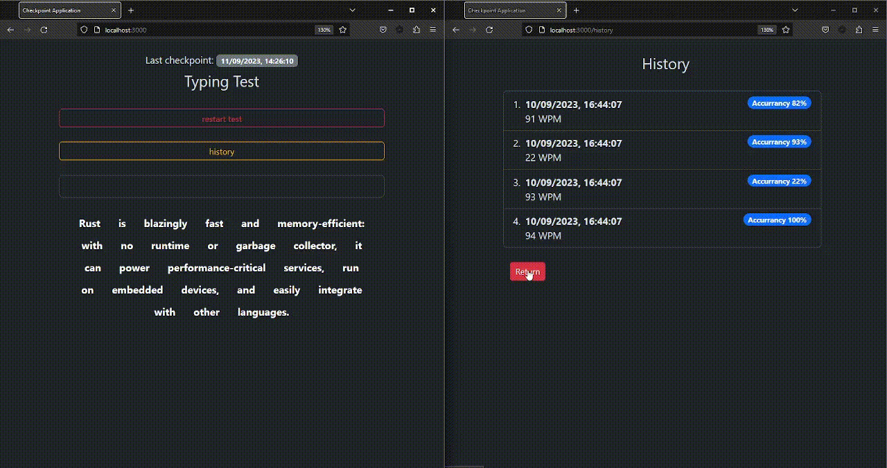

## Threds and more
This _Typing Test_ application has a checkpointing system, it restore his status on any moment, providing a status restore subsystem. On the other hand, applications serve a "history" page, with a specialized worker thread to wait for and display the history without interfering with the parent process serving the application.

### Need to know
- The application works as a npm basic project, see `package.json` to clear dependecies.
- Run, into the `app` folder, `yarn install` and then `yarn run dev` to start the application.
- Go to `http://localhost:3000` or `http://localhost:3000/history` and enjoy :).