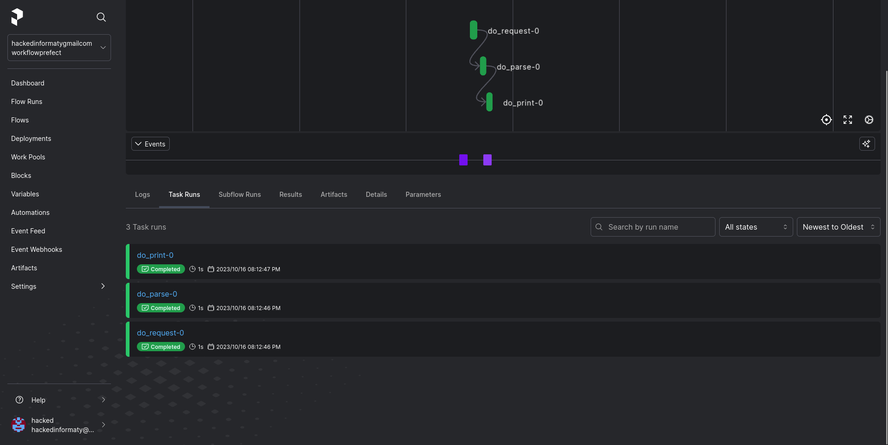
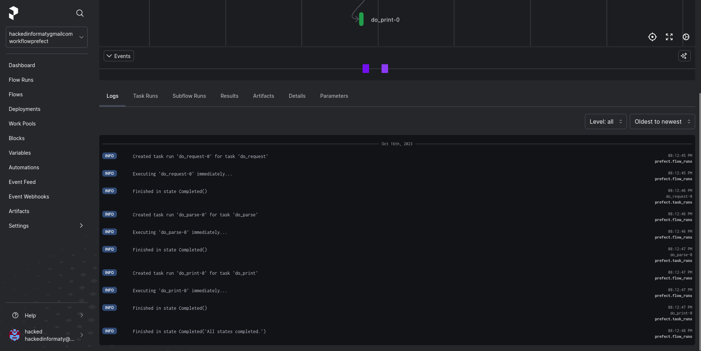
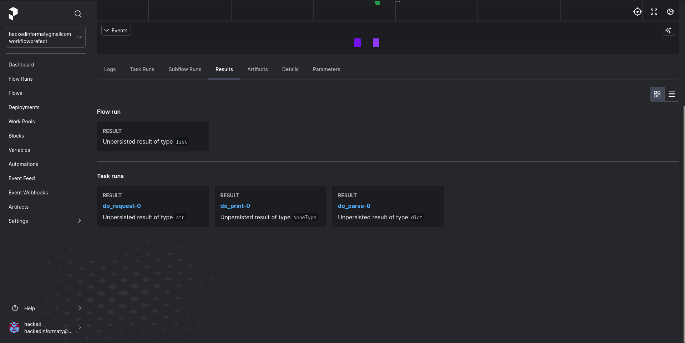

> Felipe Alejandro Jiménez Castillo 215671386
> Universidad de Guadalajara - CUCEI
> Computación Tolerante a Fallas
> Workflow

### Introducción
Un flujo de trabajo, también conocido como \textit{\textbf{workflow}} en inglés, es una secuencia de pasos y tareas interconectadas que se diseñan para lograr un objetivo específico. Los flujos de trabajo son comunes en una amplia variedad de entornos, desde negocios y organizaciones hasta procesos personales. Estos son algunos aspectos clave de los flujos de trabajo:

1. _Secuencia de pasos_: Un flujo de trabajo se compone de una serie de pasos o tareas que se realizan en un orden particular. Cada paso puede depender del resultado del anterior.
2. _Automatización_: En muchos casos, los flujos de trabajo se diseñan para automatizar procesos y tareas, lo que puede aumentar la eficiencia y reducir la posibilidad de errores.
3. _Asignación de roles_: Los flujos de trabajo suelen incluir la asignación de tareas a elementos específicos. Esto asegura que cada parte del proceso se realice de manera adecuada.
4. _Reglas y condiciones_: Los flujos de trabajo a menudo incluyen reglas y condiciones que determinan cómo deben ejecutarse los pasos. Por ejemplo, una tarea puede estar programada para activarse solo después de que se cumpla cierta condición.
5. _Gestión y seguimiento_: Los flujos de trabajo suelen incluir herramientas para la gestión y seguimiento de tareas, lo que permite a los responsables supervisar el progreso y realizar ajustes según sea necesario.

## Desarrollo
### Script python
Para el desarrollo de está actividad, se desarrollo un flujo de trabajo que trabajara con \textit{prefect}, de modo que, utilizando sus API's web, ver como es el proceso de trabajo en nuestro flujo de trabajo.

El programa está diseñado en 3 tareqas, de modo que nuestro flujo de trabajo este separado por partes y pueda ser modular:
- `do_request`: Esta función realiza una petición a un API web que nos trae en formato JSON.
- `do_parse`: Está función realiza el parseo de datos de texto plano a un formato JSON real.
- `do_print`: Está función muestra los datos obtenidos por la petición.

Con esto en mente se finalizo desarrollando una función que sería nuestro flujo principal y llamaría a las otras tareas para ser ejecutadas y demostradas.

## Conclusión
Los flujos de trabajo permiten automatizar tareas y procesos, lo que aumenta la eficiencia al eliminar la necesidad de realizar manualmente tareas repetitivas. Esto ahorra tiempo y recursos. Además al seguir un flujo de trabajo predefinido, se garantiza la consistencia en la ejecución de tareas. Esto es crucial en la producción de resultados confiables y de alta calidad. Por lo tanto en entornos empresariales y proyectos tecnológicos, los flujos de trabajo ayudan a gestionar la complejidad. Los proyectos suelen constar de muchas tareas interconectadas, y un flujo de trabajo claro y organizado facilita su gestión.

## Bilbiografia
- Sharp, A. (2008). Workflow modeling: Tools for process improvement and application development, second edition (2nd ed.). Artech House.