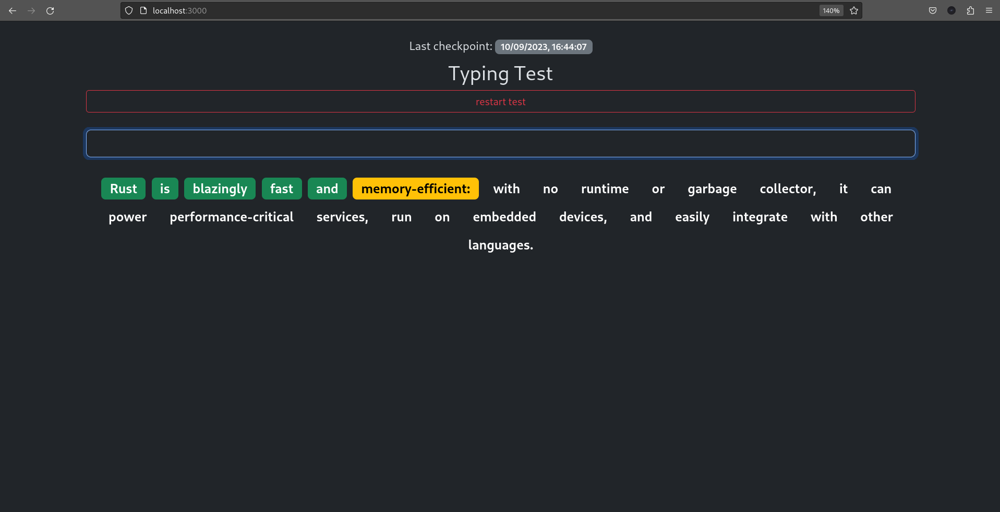

> Felipe Alejandro Jiménez Castillo
> 215671386
> Universidad de Guadalajara - CUCEI
> Computación Tolerante a Fallas
> Docker (Contenedores)

# Introducción
_Docker_ es una plataforma de software que te permite crear, probar e implementar aplicaciones rápidamente. Docker empaqueta software en unidades estandarizadas llamadas contenedores que incluyen todo lo necesario para que el software se ejecute, incluidas bibliotecas, herramientas de sistema, código y tiempo de ejecución. Con Docker, puede implementar y ajustar la escala de aplicaciones rápidamente en cualquier entorno con la certeza de saber que su código se ejecutará.

La tecnología Docker utiliza el kernel de Linux y sus funciones, como los grupos de control y los espacios de nombre, para dividir los procesos y ejecutarlos de manera independiente. El propósito de los contenedores es ejecutar varios procesos y aplicaciones por separado para que se pueda aprovechar mejor la infraestructura y, al mismo tiempo, conservar la seguridad que se obtendría con los sistemas individuales.

Las herramientas de los contenedores, como Docker, proporcionan un modelo de implementación basado en imágenes. Esto permite compartir fácilmente una aplicación o un conjunto de servicios, con todas las dependencias en varios entornos. Docker también automatiza la implementación de las aplicaciones (o los conjuntos de procesos que las constituyen) en el entorno de contenedores.

Estas herramientas están diseñadas a partir de los contenedores de Linux, por eso la tecnología Docker es sencilla y única. Además, ofrecen a los usuarios acceso sin precedentes a las aplicaciones, la posibilidad de realizar implementaciones en poco tiempo y el control sobre las versiones y su distribución.

## Ventajas de Docker
- Modularidad
  - El enfoque de Docker sobre la organización en contenedores se centra en la capacidad de separar una parte de la aplicación para actualizarla o repararla, sin necesidad de deshabilitarla por completo. Además de aprovechar este modelo basado en los microservicios, puede intercambiar procesos entre varias aplicaciones casi de la misma forma en que funciona la arquitectura orientada a los servicios (SOA).
- Capas y control de versiones de imágenes
  - Cada archivo de imagen Docker está compuesto por varias capas que conforman una sola imagen. Cuando un usuario especifica un comando, como ejecutar o copiar, la imagen cambia, y se crea una capa nueva.
  - Docker reutiliza las capas para agilizar el diseño de los contenedores nuevos. Los cambios intermedios se comparten entre las imágenes para mejorar aún más la agilidad, el tamaño y la eficiencia. El control de versiones también es propio de la creación de capas: el registro incorporado de los cambios le brinda el control total de las imágenes de contenedores cada vez que se produce una modificación.
- Restauración
  - Uno de los mayores beneficios de las capas es la capacidad de restauración. Todas las imágenes cuentan con capas. Si no le gusta la iteración actual de una imagen, puede restaurarla a una versión anterior. Esto respalda el enfoque de desarrollo ágil y permite lograr la integración e implementación continuas (CI/CD) desde la perspectiva de las herramientas.
- Implementación rápida
  - Antes, se necesitaban varios días para poner en marcha un sistema de hardware nuevo, implementarlo y ponerlo a disposición de los usuarios, lo cual implicaba un esfuerzo y un costo abrumadores. Con los contenedores basados en Docker, la implementación se puede realizar en cuestión de segundos. Cada proceso se encuentra en un contenedor distinto, por lo que puede compartirlos con aplicaciones nuevas rápidamente. Además, ya que no es necesario iniciar el sistema operativo para agregar o trasladar un contenedor, los tiempos de implementación son mucho más cortos, y puede crear datos y eliminar aquellos que generen los contenedores de manera fácil y rentable, sin preocupaciones.

En definitiva, la tecnología Docker tiene un enfoque más detallado y controlable, que se basa en los microservicios y que prioriza la eficiencia.

# Desarrollo
## Script (_dockerfile_)
Para el desarrollo de está actividad, se desarollo una aplicación simple que requiere de un servicio web activo para acceder a la misma, por lo que es un caso de estudio perfecto para implementar una solución con Docker.

El Dockerfile consta de 3 partes:
1. Imagen: En la primer línea definimos que imagen de Docker se utilizará para crear nuestro contenedor, para este caso partículas, debido a que nuestra app es utiliza NodeJs, utilizamos la imagen proporcionada por el mismo proyecto, utilizando la variación de _NodeJs 18_ y _Alpine Linux_, que es la imagen de Linux más ligera.
2. Directorio de trabajo: En la 2da y 3ra línea definimos cual es el directorio principal que se utilizará como espacio de trabajo dentro de nuestro contenedor (`/app`), para después copiar todo nuestro proyecto (de nuestra maquina principal) a el espacio de trabajo dentro del contenedor.
3. Comandos: Las ultimas dos lineas son ejecutadas como comandos comunes de Linux, estás realizan la instalación de las dependencias del proyecto y finalmente inicializan el proyecto en modo desarrollo, de forma que nuestra app está, ahora, en ejecución.

 Una vez se definió la estructura de nuestro contenedor, solo nos queda crear la imagen, iniciarla y utilizar nuestra app.
 \begin{enumerate}

# Conclusión
Finalmente podemos denotar la importancia de Docker, ya que está herramienta es importante muy importante, ya que revoluciona la forma en que desarrollamos, entregamos y ejecutamos aplicaciones. Proporciona un entorno más consistente, eficiente y seguro para el desarrollo y la implementación de software, lo que a su vez mejora la productividad, reduce los costos y permite la escalabilidad de las aplicaciones de manera efectiva.

# Bilbiografia
1. What is docker? (n.d.). Redhat.com. Retrieved October 24, 2023, from https://www.redhat.com/en/topics/containers/what-is-docker