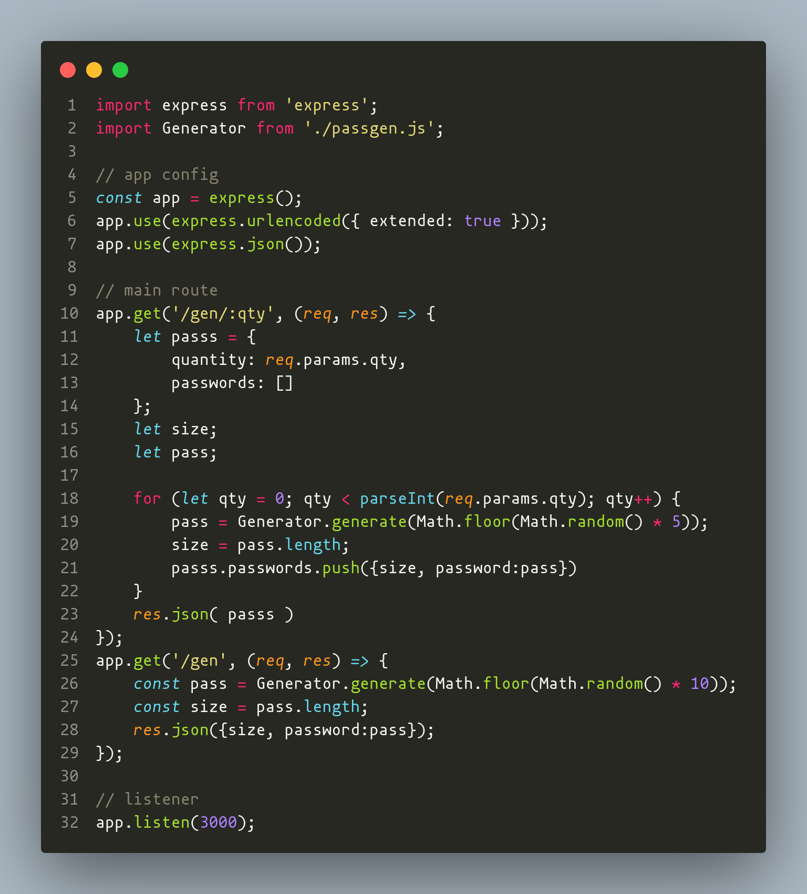
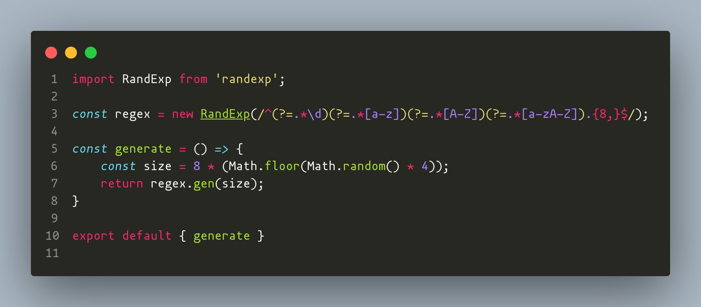
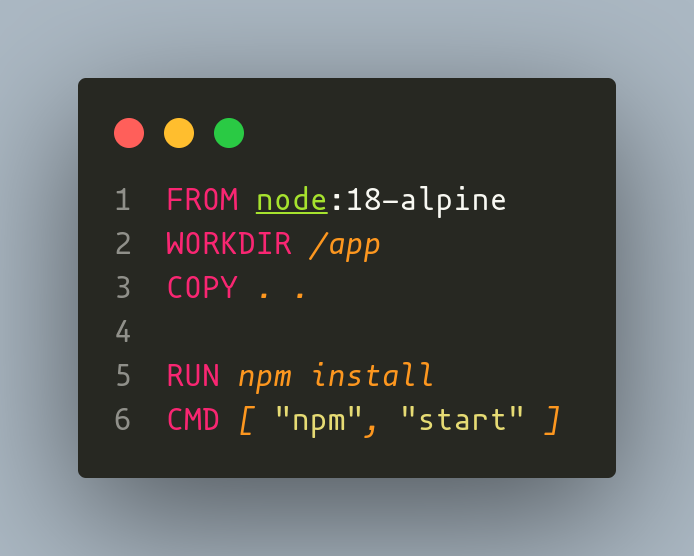
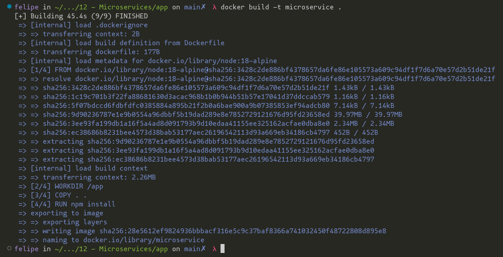
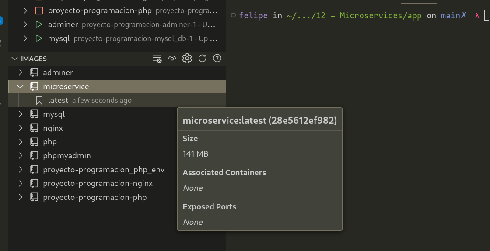
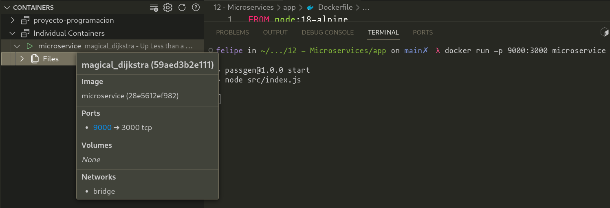
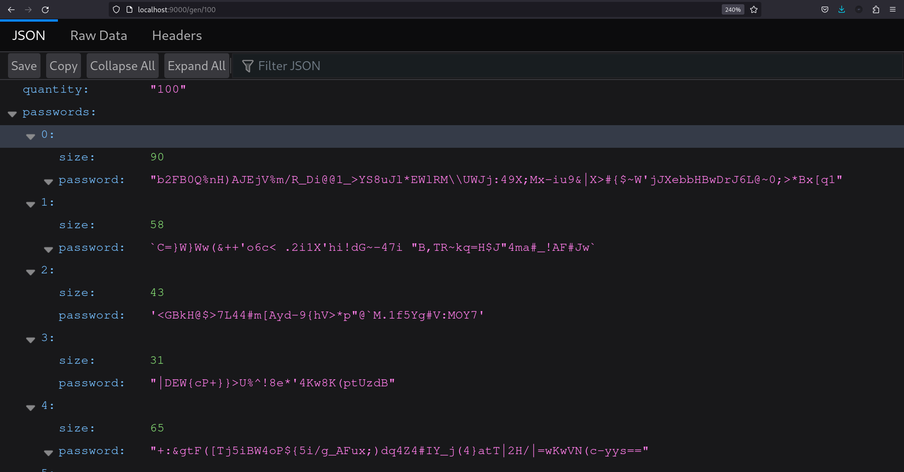

> Felipe Alejandro Jiménez Castillo
> 215671386
> Universidad de Guadalajara - CUCEI
> Computación Tolerante a Fallas
> Microservicios y NodeJS

# Introducción
_Docker_ es una plataforma de software que te permite crear, probar e implementar aplicaciones rápidamente. Docker empaqueta software en unidades estandarizadas llamadas contenedores que incluyen todo lo necesario para que el software se ejecute, incluidas bibliotecas, herramientas de sistema, código y tiempo de ejecución. Con Docker, puede implementar y ajustar la escala de aplicaciones rápidamente en cualquier entorno con la certeza de saber que su código se ejecutará.

La tecnología Docker utiliza el kernel de Linux y sus funciones, como los grupos de control y los espacios de nombre, para dividir los procesos y ejecutarlos de manera independiente. El propósito de los contenedores es ejecutar varios procesos y aplicaciones por separado para que se pueda aprovechar mejor la infraestructura y, al mismo tiempo, conservar la seguridad que se obtendría con los sistemas individuales.

Las herramientas de los contenedores, como Docker, proporcionan un modelo de implementación basado en imágenes. Esto permite compartir fácilmente una aplicación o un conjunto de servicios, con todas las dependencias en varios entornos. Docker también automatiza la implementación de las aplicaciones (o los conjuntos de procesos que las constituyen) en el entorno de contenedores.

Estas herramientas están diseñadas a partir de los contenedores de Linux, por eso la tecnología Docker es sencilla y única. Además, ofrecen a los usuarios acceso sin precedentes a las aplicaciones, la posibilidad de realizar implementaciones en poco tiempo y el control sobre las versiones y su distribución.

# Desarrollo
El desarrollo de la aplicación es sencillo, para esto se genero un servicio pequeño que sirve de contraseñas respecto a un servicio web, por lo que se diseño una aplicación en NodeJS, con el fin de levantar un servido WEB y meterlo dentro de un contenedor, de manera que podamos linkear tanto el contenedor con un puerto libre en nuestra red. El proceso y código de la aplicación puede ser visto enseguida.

# Conclusión

# Bilbiografia
1. What is docker? (n.d.). Redhat.com. Retrieved October 24, 2023, from https://www.redhat.com/en/topics/containers/what-is-docker